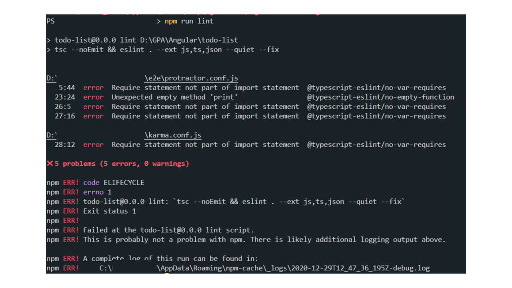

# angular-cleancode

Mise en place d'outils afin de faciliter la vie d'un développeur Angular.

Le but est de déléguer les tâches de "clean code" à ces outils permettant ainsi au développeur de se concentrer uniquement sur ces tâches.

## ESLint

ESLint est un linter permettant d'analyser le code et de vérifier si les règles de syntaxe et de qualité spécifiée par un ensemble de personne sont respectées.

Ce linter, est le plus connu dans le monde du JavaScript/TypeScript pour ses multiples configurations.

## Prettier

Le but de prettier est de formater automatiquement le code selon des règles définies.

## Husky

[Librairie](https://github.com/typicode/husky) permettant la création et la gestion des "git hooks" plus facilement.

> Pour information, **un "hook"** est un **script qui s'exécute de manière automatique** lorsqu'un événement se produit. Dans notre cas, les événements proviennent de git.

Nous pouvons ajouter des hooks sur à peu près sur tous les événements :

-   applypatch-msg
-   pre-applypatch
-   post-applypatch
-   pre-commit
-   prepare-commit-msg
-   commit-msg
-   post-commit
-   pre-rebase
-   post-checkout
-   post-merge
-   pre-receive
-   update
-   post-receive
-   post-update
-   pre-auto-gc
-   post-rewrite
-   pre-push

Dans notre cas, nous utiliserons les événements **pre-commit** et **pre-push** cf.configuration. Ces événements, sont les plus utilisés. Ils permettent d'assurer au développeur un filet de sécurité visant à maintenir la qualité du code avant d'effectuer les actions de commit et de push sur le serveur.

### Installation

#### 1°) ESLint 
Cet outil, peut être installé soit au global ou au niveau du projet, dans les dépendances de développement *(--save-dev)* . Chaque projet **dispose de règles et d'outils différents**. Pour cela, je vous conseil de **l'installer au niveau du projet.** 

    npm i --save-dev eslint

N'oublions pas qu'Angular est un Framework orienté TypeScript. Il faut donc installer un plugin contenant tout un tas de règles spécifiques à TypeScript.

    npm install --save-dev @typescript-eslint/eslint-plugin

#### 2°) Prettier

    npm i --save-dev prettier prettier-eslint eslint-config-prettier eslint-plugin-prettier

#### 3°) Husky 

    npm i --save-dev husky

### Configuration

#### 4°) ESLint 

##### 4.1°) Ajouter un fichier `.eslintrc.json` à la racine du projet, puis ajouter cette configuration :

    {
	  "parser": "@typescript-eslint/parser", // Spécification du parser ESLint
	  "extends": [
	    "plugin:@typescript-eslint/recommended", // Utilisation des règles recommandées hérité de @typescript-eslint/eslint-plugin
	    "prettier/@typescript-eslint", // Utilisation de eslint-config-prettier pour désactiver les règles ESLint héritées de @typescript-eslint/eslint-plugin qui peut être en conflit avec prettier
	    "plugin:prettier/recommended" // Activation de eslint-plugin-prettier et de eslint-config-prettier. Ceci affichera des erreurs provenant de prettier. Soyez sûr que cette configuration soit toujours la dernière configuration de ce tableau d'extension.
	  ],
	  "parserOptions": {
    "ecmaVersion": 2020, // Permet de "parser" les dernières fonctionnalités ECMAScript.
    "sourceType": "module" // Permet d'utiliser les imports
	  },
	  "rules": {
    // Placer ici les règles ESLint. Ils peuvent être utilisées pour surcharger les règles déjà spécifiées dans le tableau d'héritage.
	  }
	}

##### 4.2°) Ajouter un fichier `.eslintignore` à la racine du projet puis y ajouter : 

    package.json
	package-lock.json
	dist

Selon le projet, il faudra ajouter d'autre fichier/dossier. Ce fichier sera agrémenté tout au long de la vie du projet.

##### 4.3°) Modification du script `lint` dans le fichier `package.json`

Modifier le script `lint` pour y ajouter : 

    "lint": "tsc --noEmit && eslint . --ext js,ts,json --quiet --fix"

Ce script, permettra de vérifier l'état de votre application par étape. 

 - Repasser tous les fichiers TypeScript, JavaScript et JSON afin de regarder si toutes les règles ont étaient respectées (`tsc --noEmit && eslint . --ext js,ts,json`)
 - De manière silencieuse, et si les erreurs peuvent être corrigées (`--quiet --fix`)

Vous pouvez **lancer ce script** avec la commande `npm run lint`.

#### 5°) Prettier

Ajouter un fichier `.prettierrc.json` à la racine du projet, puis ajouter cette configuration : 

    {
	  "singleQuote": true,
	  "trailingComma": "none",
	  "endOfLine": "auto"
	}

Vous pouvez [configurer](https://prettier.io/docs/en/configuration.html) Prettier comme vous le voulez.

Si vous utilisez [Visual Studio Code](https://code.visualstudio.com/), vous pouvez installer les extensions suivantes : 

    dbaeumer.vscode-eslint
    esbenp.prettier-vscode

Puis les configurer dans le fichier `.vscode/settings.json`

	{
	"[javascript]": {
	    "editor.defaultFormatter": "dbaeumer.vscode-eslint",
	    "editor.codeActionsOnSave": {
	      "source.fixAll.eslint": true
	    },
	    "editor.formatOnSave": false
		  },
	  "[typescript]": {
	    "editor.defaultFormatter": "dbaeumer.vscode-eslint",
	    "editor.codeActionsOnSave": {
	      "source.fixAll.eslint": true
	    },
	    "editor.formatOnSave": false
	  },
	  "[json]": {
	    "editor.defaultFormatter": "dbaeumer.vscode-eslint",
	    "editor.codeActionsOnSave": {
	      "source.fixAll.eslint": true
	    },
	    "editor.formatOnSave": false
	  }
	}

#### 6°) Husky

Modifier le fichier `package.json` pour ajouter la configuration du hook husky ci-dessous : 

    "husky": {
     "hooks": {
         "pre-commit": "ng lint",
         "pre-push": "ng build --aot true"
     }
    }

Lorsque vous effectuerez une action de commit et ou de push le hook se lancera.
